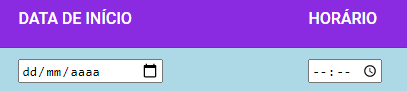
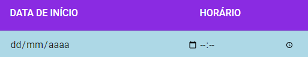

# APLICATIVO SAUDE&INFO+

Esse projeto buscou simular um aplicativo de celular para as pessoas da terceira idade, com o nome de Saude&Info+. Ele foi construído com a versão 11.2.6 do framework <a href="https://angular.io/" target="_blank">Angular</a>, pois é o framework que os membros restantes do grupo da matéria de Interação Humano Computador - UnB de 2020.2 estavam habituados. 

 <h2>Instalação</h2>
Abaixo, as instruções para que seja possível montar o projeto em sua máquina:

<ol>
  <li>Baixe o zip ou clone esse repositório</li>
  <li>Baixe e instale o npm e o nodeJS no site oficial <a href="https://nodejs.org/en/" target="_blank">clicando aqui</a></li>
  <li>Abra um prompt de comando, navegue até a subpasta do projeto 'Backend' e digite os comandos:</li>
    <dd>npm install (aguarde até que a instalação seja concluida)</dd>
    <dd>npm start (aguarde até que o servidor json seja criado)</dd>
  <li>Abra um novo prompt de comando, e nele, navegue até a subpasta do projeto 'SaudeInfo'</li>
    <dd>npm install (aguarde até que a instalação seja concluida)</dd>
    <dd>npm start (aguarde até que o projeto seja criado)</dd>
  <li>Abra um navegador e digite o link http://localhost:4200/</li>
</ol>

 <h2>Observações</h2>
<ol>
  <li>Como o projeto não está integrado com um banco de dados, todas as informações são mantidas na sessão, logo, caso seja feito uma atualização da página, os dados são perdidos.</li>
  <li>A proposta inicial era que a parte de leitura de QrCode fosse feita pela câmera de um celular, e após as tratativas, a tabela de dias e horários serviria para alimentar o alarme que seria imbutido no aplicativo. Como isso não foi possível, criou-se um servidor json, onde arquivo de nome 'Receita' representa o json que seria retornado pela leitura do QrCode.</li>
  <li>A autenticação não foi implementada a fundo, apenas um nome de usuário é necessário para prosseguir. Caso seja feito uma atualização em outra página que não seja a de autenticação, a referência do usuário será perdida e poderá ocasionar problemas. Caso isso aconteca, basta retornar a página de autenticação e informar novamente um nome de usuário.</li>
  <li>O servidor json está configurado para ser iniciado na porta 3001, mas caso seja necessário trocar, basta ir no arquivo package.json da pasta Backend e mudar a porta na linha 7 do arquivo: "start": "json-server --watch Receita.json --port XXXX", onde XXXX é a porta que deseja disponibilizar o servidor. </li>
  <li>Na página de leitura de QrCode, após a leitura do QrCode os campos de data e horário de início do consumo podem dar a entender que estão como não editáveis, pois não ficam no padrão que era esperado (com o fundo branco), conforme as imagens abaixo, porém, pode-se editá-los clicando nos ícones ao final das colunas ou digitando diretamente no campo</li>
  <li></li>
  <li></li>
</ol>
